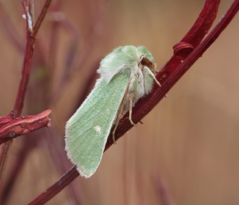

<!DOCTYPE markdown>
# HTML perusteet ja yöperhoset

Tällä nettisivulla kerron HTML perusteet kuten: Kuinka tehdä otsikko, tekstikappale, lista, kuinka liittää kuva nettisivullesi ja kuinka lisätä linkki sivullesi samalla kun kerron yöperhosista. (kerron jokaisen kohdan jälkeen miten olen tehnyt sen esim kuinka olen liittänyt kuvan)

## Kpl1 Yöperhoset

Yöperhosista suurin osa on yöeläimiä, mutta on myös harvoja jotka lentävät päivällä. Yöperhosia on noin 160 000-lajia joista monia ei olla vielä pystytty kuvaamaan

## Kpl2 Yöperhosten ja päiväperhosten ero 

Yöperhoset ovat yleensä harmaita tai ruskeita, koska tumma väri kerää hyvin auringon valoa päivällä ja naamioi ne saalistajilta, jotkut tosin ovat värikkäitä sillä ne viestittävät saalistajille olevansa pahanmakuisia tai myrkyllisiä. Ne ovat myös yleensä karvaisia ja tukevarakenteisia.

## Kpl3 Erilaiset yöperhoset
Yöperhosia on monenlaisia alle laitan listan muutamasta eri uhanalaisesta yöperhosesta suomessa ja listan suomen isoimmista yökkösistä.

* Kupariyökkönen 
* Loistokaapuyökkönen 
* Pörhönopsayökkönen 
* Kolmiviiruyökkönen 
* Valemorsiusyökkönen 
* Viheryökkönen 

1. Nastakehrääjä 65-92mm
2. Isomaayökkönen 47-66mm
3. Isomorsiusyökkönen 50-60mm
4. Lounaanmorsiusyökkönen 49-60mm
5. Huhtiyökkönen 49-56mm

## Kpl4 HTMl

Tässä kappaleessa kerron miten tein muut kappaleet.

<!--Alleviivaa kappaleet-->

kpl1 ja 2

Kappale ykkösessä tein otsikon **headingin** headingia voi käyttää myös alaotsikkona niinkuin tein muissa kappaleissa.

Headingin saa koodilla h1-h6

    <h1>Otsikko1<h1>
    <h2>Otsikko2<h2>

Headingisseja voi myös isontaa koodilla

    <h1 style="font-size:30px;">Otsikko<h1>

Paragraph 

    

paragraphit ovat tekstikappaleita joihin voi vapaasti kirjoittaa tekstiä.
Esimerkki

    
Hei kaikki

Ja jos haluat vaihtaa riviä

    
Hei kaikki 

Kpl3 

Kappale kolmosessa tein kaksi erilaista listaa numerollisen ja ei numerollisen ja lisäsin kuvan.

Numerollinen

    <ol>
    <li>Yksi</li>
    <li>Kaksi</li>
    <li>Kolme</li>
    </ol> 

Ei numerollinen

    <ul>
    <li>Yöperhonen</li>
    <li>Perhonen</li>
    <li>Koi</li>
    </ul> 

Tässä miltä se näyttää käytännössä

* perhonen
* koi

1. yksi
2. kaksi

Kuinka lisätä kuva

    

Tässä miltä se näyttää käytännössä

Linkit

    <a href="https://fi.wikipedia.org/wiki/Y%C3%B6perhonen.com/ target="_blank"">Lisätietoa yöperhosista</a>

Käytännössä näyttää tältä
 [Tietoa_perhosista]https://fi.wikipedia.org/wiki/Y%C3%B6perhonen